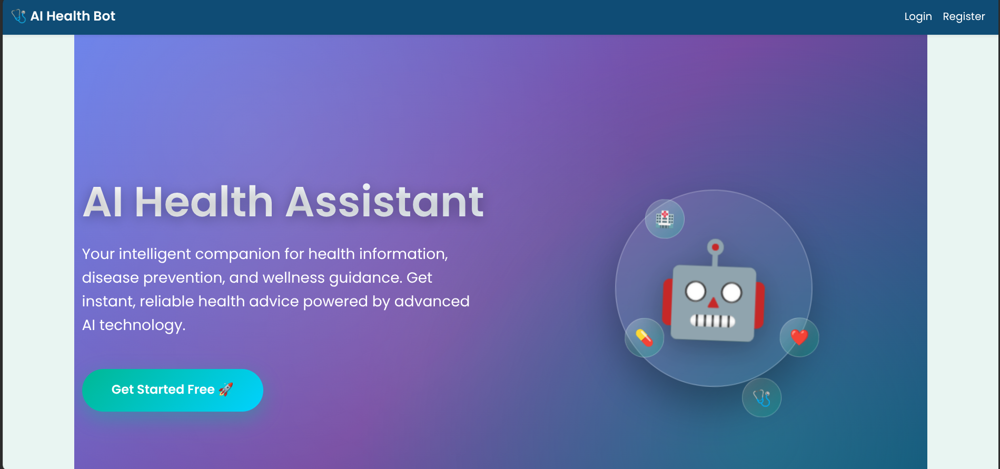
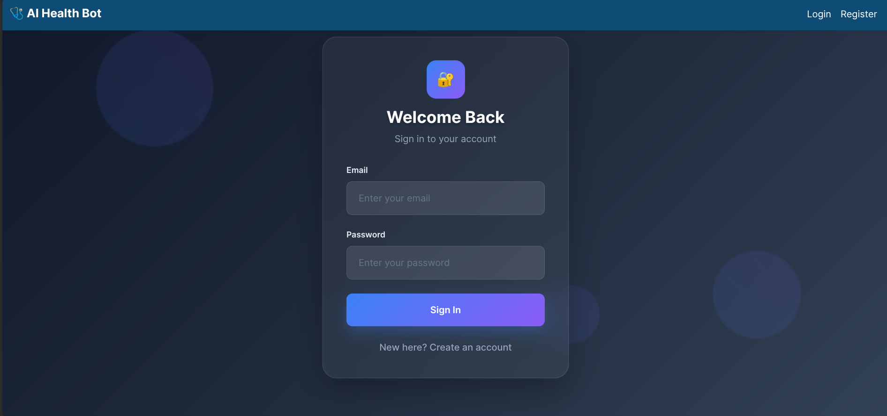
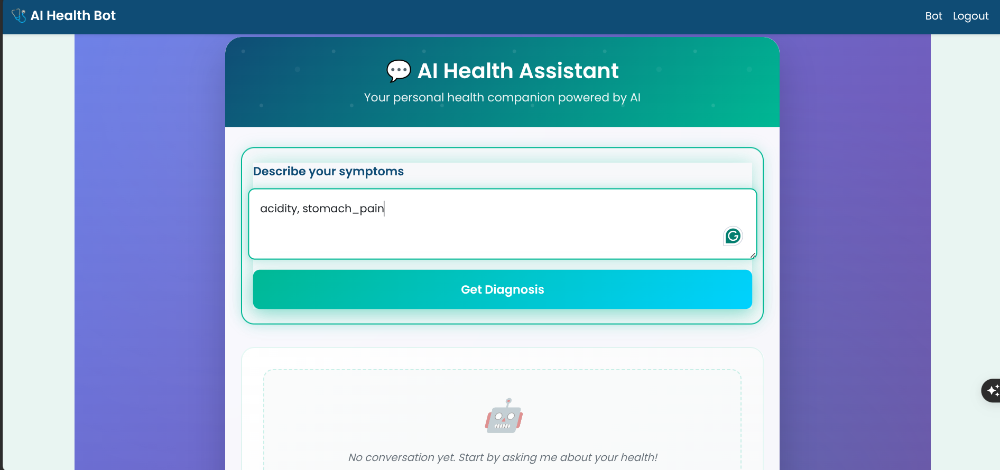
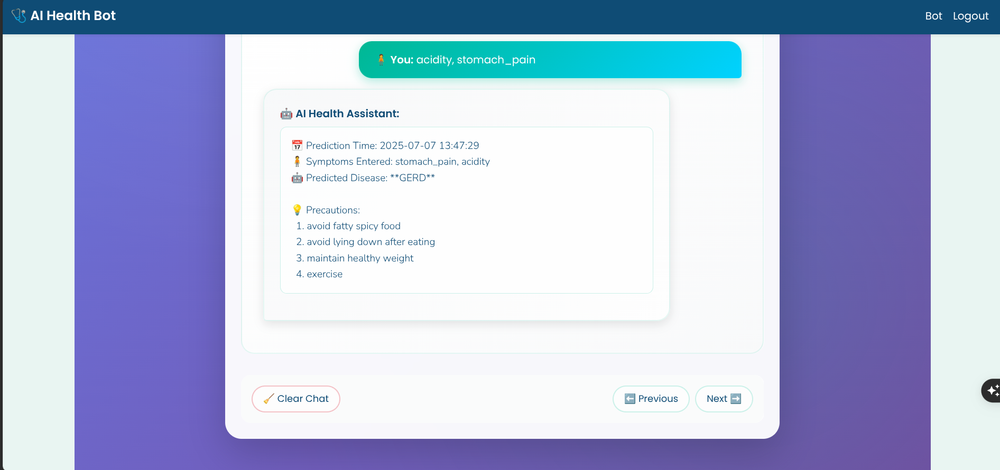

# 🤖 AI Health Assistant Bot

A full-stack Flask web application that predicts diseases based on symptoms entered by the user. The prediction is powered by a trained **Random Forest** classifier using a real dataset from Kaggle. The app supports login/registration, secure session handling, aesthetic design, and a clean backend using Flask extensions like `Flask-WTF`, `Flask-Login`, and `Flask-SQLAlchemy`.

---

## 📚 Table of Contents

- [🚀 Features](#-features)
- [🧠 Machine Learning](#-machine-learning)
- [🗂️ Project Structure](#️-project-structure)
- [⚙️ Setup Instructions](#️-setup-instructions)
- [📁 Dataset Info](#-dataset-info)
- [🧪 Sample Usage](#-sample-usage)
- [📸 Screenshots](#-screenshots)
- [🔧 Configuration](#-configuration)
- [🐛 Troubleshooting](#-troubleshooting)
- [🤝 Contributing](#-contributing)
- [📌 Dependencies](#-dependencies)
- [🙋 Author](#-author)

---

## 🚀 Features

- 🔐 User registration and login using **Flask-Login**
- 🧠 Disease prediction using trained **Random Forest Classifier**
- 📝 Symptom input using **Flask-WTF** form validation
- 📋 SQLite3 database with **Flask-SQLAlchemy**
- 💾 Session management using cookies
- 🎨 Clean and aesthetic UI using custom CSS and Bootstrap
- 📂 Structured code using Blueprints and MVC pattern
- 🧾 Symptom list stored in `bot/symptoms_list.txt`
- 🔍 Real-time symptom suggestions and validation
- 📊 Prediction confidence scores
- 📱 Responsive design for mobile and desktop
- 🛡️ Secure password hashing with Werkzeug
- 📈 User prediction history tracking

---

## 🧠 Machine Learning

The ML model is trained using a cleaned version of the Kaggle dataset:
📦 [`itachi9604/disease-symptom-description-dataset`](https://www.kaggle.com/datasets/itachi9604/disease-symptom-description-dataset)

### Model Details
- **Algorithm used:** Random Forest Classifier
- **Libraries:** scikit-learn, pandas, joblib
- **Accuracy:** ~100% on test data
- **Features:** 17 symptom columns
- **Target:** Disease prediction (48 unique diseases)

### Training Pipeline
- Data loaded and cleaned
- Label encoding applied to diseases
- Feature engineering and preprocessing
- Model trained and tested with cross-validation
- Hyperparameter tuning for optimal performance
- Model serialized using `joblib` to `model.pkl`
- Symptoms stored in `symptoms_list.txt` for the UI

**Notebook:** `notebook/training_pipeline.ipynb`

---

## 🗂️ Project Structure

```text
ai-health-bot/
├── app.py                    # Main Flask app entry
├── .gitignore
├── README.md
├── requirements.txt          # Python dependencies
├── dataset/
│   └── disease_symptom.csv   # Cleaned dataset from Kaggle
├── notebook/
│   └── training_pipeline.ipynb
├── bot/
│   ├── logic.py              # Prediction logic
│   ├── model.pkl             # Trained ML model
│   └── symptoms_list.txt     # Unique symptoms list
├── static/
│   ├── favicon/bot.png
│   ├── css/styles.css
│   ├── js/script.js          # Frontend JavaScript
│   └── screenshots/          # Application screenshots
├── templates/
│   ├── layout.html           # Base template
│   ├── index.html            # Home page
│   ├── predict.html          # Prediction form
│   ├── summary.html          # Results page
│   └── auth/
│       ├── login.html
│       └── register.html
├── controllers/
│   ├── user_routes.py        # Authentication routes
│   └── prediction_routes.py  # Prediction routes
├── models/
│   └── user_model.py         # User database model
├── config/
│   └── config.py             # Application configuration
└── instance/
    └── app.db                # SQLite3 database
```

---

## ⚙️ Setup Instructions

### Prerequisites
- Python 3.7 or higher
- pip package manager
- Virtual environment (recommended)

### Installation Steps

```bash
# 1. Clone the repository
git clone https://github.com/sharib-ahmad/ai-health-bot.git
cd ai-health-bot

# 2. Create virtual environment
python3 -m venv venv
source venv/bin/activate     # On Windows: venv\Scripts\activate

# 3. Install dependencies
pip install -r requirements.txt

# 4. Set environment variables (optional)
export FLASK_APP=app.py
export FLASK_ENV=development
export SECRET_KEY=your-secret-key-here


# 5. Run the application
python app.py
```

The application will be available at `http://localhost:5000`

---

## 📁 Dataset Info

**Dataset Source:** 🔗 [Kaggle - Disease Symptom Description](https://www.kaggle.com/datasets/itachi9604/disease-symptom-description-dataset)

**Used File:** `dataset/disease_symptom.csv`

### Dataset Structure
```
Symptom_1, Symptom_2, ..., Symptom_17, Disease
```

### Dataset Statistics
- **Total Records:** 4,920
- **Unique Diseases:** 41
- **Unique Symptoms:** 131
- **Features:** 17 symptom columns
- **Data Quality:** Clean with no missing values

---

## 🧪 Sample Usage

1. **Registration:** Go to `/register` → Create a new user account
2. **Login:** Access `/login` → Sign in with your credentials
3. **Symptom Input:** Enter symptoms (comma-separated) like:
   ```
   fever, cough, fatigue, headache
   ```
4. **Prediction:** Click "Predict" to view the disease result
5. **Results:** View detailed disease information and recommendations
6. **Logout:** Use the navigation menu to sign out securely

---

## 📸 Screenshots

| Feature | Preview |
|---------|---------|
| Home Page |  |
| Login |  |
| Prediction |  |
| Results |  |

---

## 🔧 Configuration

### Environment Variables
```bash
# Required
SECRET_KEY=your-secret-key-here
DATABASE_URL=sqlite:///instance/app.db

# Optional
FLASK_ENV=development
FLASK_DEBUG=True
```

### Database Configuration
The application uses SQLite by default. For production, consider PostgreSQL:

```python
# config/config.py
SQLALCHEMY_DATABASE_URI = os.environ.get('DATABASE_URL') or 'sqlite:///app.db'
```

---

## 🐛 Troubleshooting

### Common Issues

**1. Model Loading Error**
```bash
# Ensure model.pkl exists in bot/ directory
python -c "import joblib; print(joblib.load('bot/model.pkl'))"
```

**2. Database Connection Error**
```bash
# Recreate database
rm instance/app.db
flask db upgrade
```

**3. Import Errors**
```bash
# Reinstall dependencies
pip install -r requirements.txt --force-reinstall
```

**4. Port Already in Use**
```bash
# Change port in app.py
app.run(debug=True, port=5001)
```

---

## 🤝 Contributing

We welcome contributions! Please follow these steps:

1. Fork the repository
2. Create a feature branch (`git checkout -b feature/AmazingFeature`)
3. Commit your changes (`git commit -m 'Add some AmazingFeature'`)
4. Push to the branch (`git push origin feature/AmazingFeature`)
5. Open a Pull Request

### Development Guidelines
- Follow PEP 8 coding standards
- Add docstrings to functions
- Write unit tests for new features
- Update documentation as needed

---

## 📌 Dependencies

```text
Flask==2.3.3
Flask-WTF==1.1.1
Flask-Login==0.6.2
Flask-SQLAlchemy==3.0.5
scikit-learn==1.3.0
joblib==1.3.2
pandas==2.0.3
numpy==1.25.2
Werkzeug==2.3.7
WTForms==3.0.1
```

### Development Dependencies
```text
pytest==7.4.0
flask-testing==0.8.1
coverage==7.2.7
```

Install all dependencies:
```bash
pip install -r requirements.txt
```

---


---

## 🙋 Author

👨‍💻 **Sharib Ahmad**

📫 **Contact:**
- Personal: sharibahmad6716@gmail.com
- Academic: 24f2001786@ds.study.iitm.ac.in

🎓 **Background:**
- B.S. Student in Data Science & AI
- AI, ML & Data Science Enthusiast
- Full-Stack Developer

🔗 **Connect:**
- GitHub: [@sharib-ahmad](https://github.com/sharib-ahmad)
- LinkedIn: [Sharib Ahmad](https://www.linkedin.com/in/sharib-ahmad-765b90311/)

---

⭐ **If you found this project helpful, please consider giving it a star!**

[](https://github.com/sharib-ahmad/ai-health-bot)
[](https://github.com/sharib-ahmad/ai-health-bot/fork)

---

**⚠️ Disclaimer:** This application is for educational purposes only. Always consult with healthcare professionals for medical advice and diagnosis.